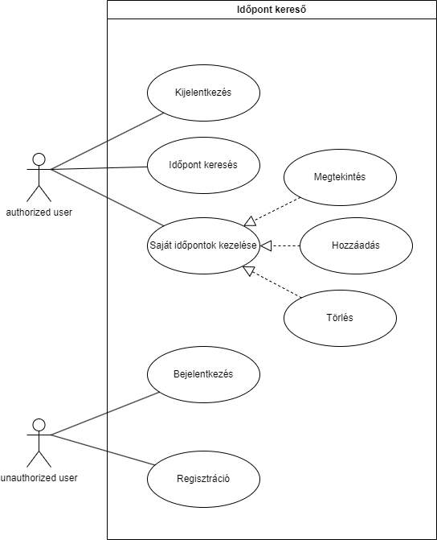
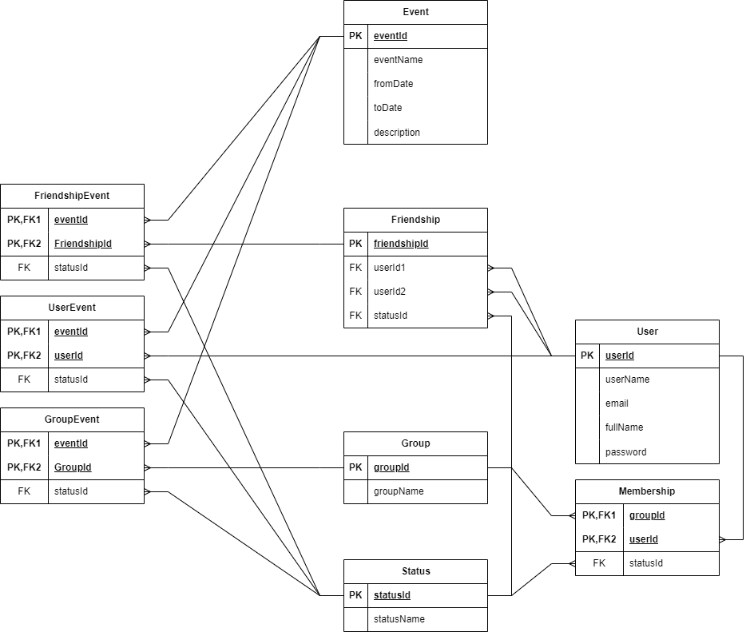
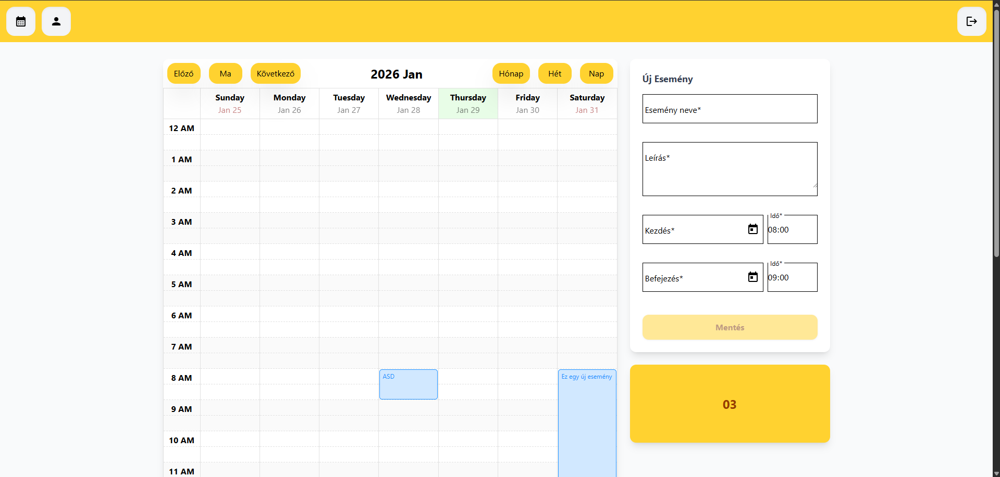
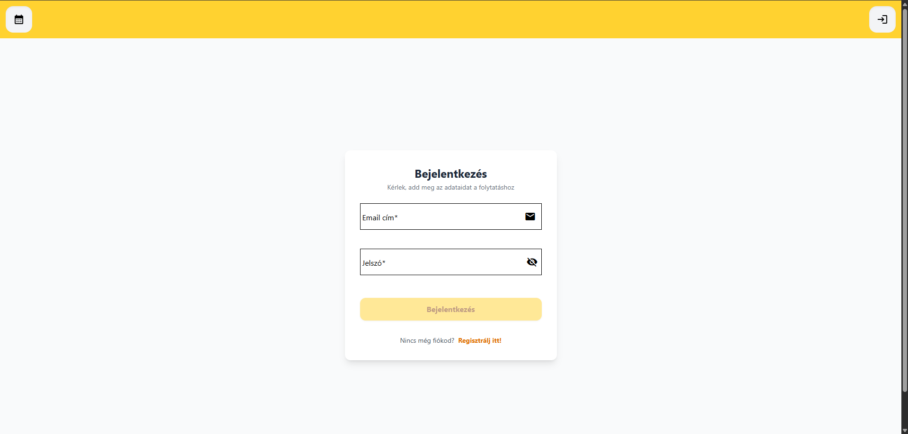
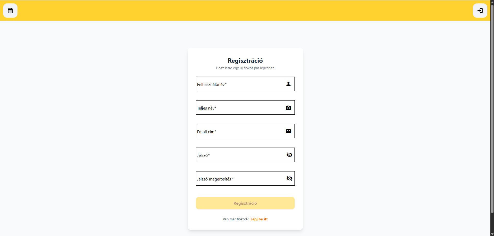

# Időpontfoglaló Alkalmazás

Ez egy Full-Stack webalkalmazás, amely lehetővé teszi a felhasználók számára, hogy regisztráljanak, bejelentkezzenek, és időpontokat/eseményeket rögzítsenek egy interaktív naptárban.

## A program fő funkciója

#### A probléma

Mindenki számára nehézséget okoz, az időpont egyeztetése mással vagy akár több személlyel egyszerre, úgy hogy mindenkinek megfeleljen, ami akár sok időt vehet igénybe.

#### A megoldás

A program két felhasználó vagy egy csoport között megkeresi az első lehetséges időpontot az új esemény feltételei alapján, amely mindenkinek megfelelő legyen.

## Tech Stack

**Frontend:**
* Angular
* Angular Material
* Tailwind CSS
* Angular Calendar

**Backend:**
* Node.js
* Express.js
* Mongoose (MongoDB ODM)
* JWT (JSON Web Token) & Bcryptjs

## Use-case diagram

## Egyed kapcsolat diagram

## API Végpontok

| Metódus | Végpont | Leírás |
| :--- | :--- | :--- |
| `POST` | `/api/auth/register` | Új felhasználó regisztrációja |
| `POST` | `/api/auth/login` | Bejelentkezés (Token kérése) |
| `GET` | `/api/events` | Saját események lekérdezése |
| `POST` | `/api/events/create` | Új esemény létrehozása |

## Képernyőtervek

### Fő oldal

* A főoldal jelenleg így néz ki, a 03 div-ben elképzelésem szerint majd a csoportok (amelyben benne van az adott user) és az ismerősők fognak megjelenni.

### Bejelentkezés

* Ez egy kezdetleges bejelentkezés oldal, a inputok dizájnával nem vagyok megelégedve, későbbiekben módosulni fog.
### Regisztráció

* Hasonlóan a bejelentkezéshez, az input itt is módosulni fog.
## Előrehaladás

#### Funkciók

* **Autentikáció:** Biztonságos regisztráció és bejelentkezés (JWT Token alapú).
* **Naptár Nézet:** Heti/Havi nézet az események áttekintéséhez.
* **Események Kezelése:** Új események létrehozása dátum és pontos idő megadásával.
* **Reszponzív Design:** Modern megjelenés Tailwind CSS és Angular Material segítségével.
* **Adatbázis:** MongoDB alapú adattárolás (User, Event, Status kapcsolatok).

#### Futtatás

* Az angular és express jelenleg még lokálisan futtatható **ng-serve** és **node app.js** paranccsal.
* Az adatbázis már publikusan elérhető **MongoDB Atlas** segítségével és az alkalmazásban is így érhető el.

## További teendők

#### Funkciók

* **Ismeretség kezelés:** A felhasználóknak legyen lehetősége embereket bejelölni, hogy könnyen tudjanak közös időpontot létrehozni.
* **Csoport kezelés:** Legyen lehetőség csoportokat létrehozni, hogy egyszerre több embernek lehessen időpontot létrehozni.
* **Események kategorizálása:** A felhasználónak legyen lehetősége színekkel jelölni az eseményeket.
* **Események módosítása és törlése**
* **Szabad időpont megtalálása (fő funkció):** A felhasználó gombnyomásra megkapja az első lehetséges időpontot, amely mindenkinek megfelelő az eltárolt időpontok alapján.

#### Oldalak
* **Profil oldal:** Elképzelésem szerint a profil oldalon lesz lehetőség beállításokat módosítani. pl.: A naptárban az óra mettől meddig töltsön be (ez alapértelmezettként jelenleg 0-24 órában mutatja).

#### Kérdéses funkciók

* **Naptár importálás:** A tervek szerint lesz egy megoldás arra, hogy a google vagy egyéb naptárból inportálni tudjuk az eseményeket. 
* **Naptár mentése:** Ugyan ez mint az importálás, csak ebben az esetbe a saját naptárunkba tudjuk menteni az adatokat a weboldalról. 

#### Hosting

* **Firebase:** A tervek szerint az Angular és az Express is Firebase-ben lesz hostolva.